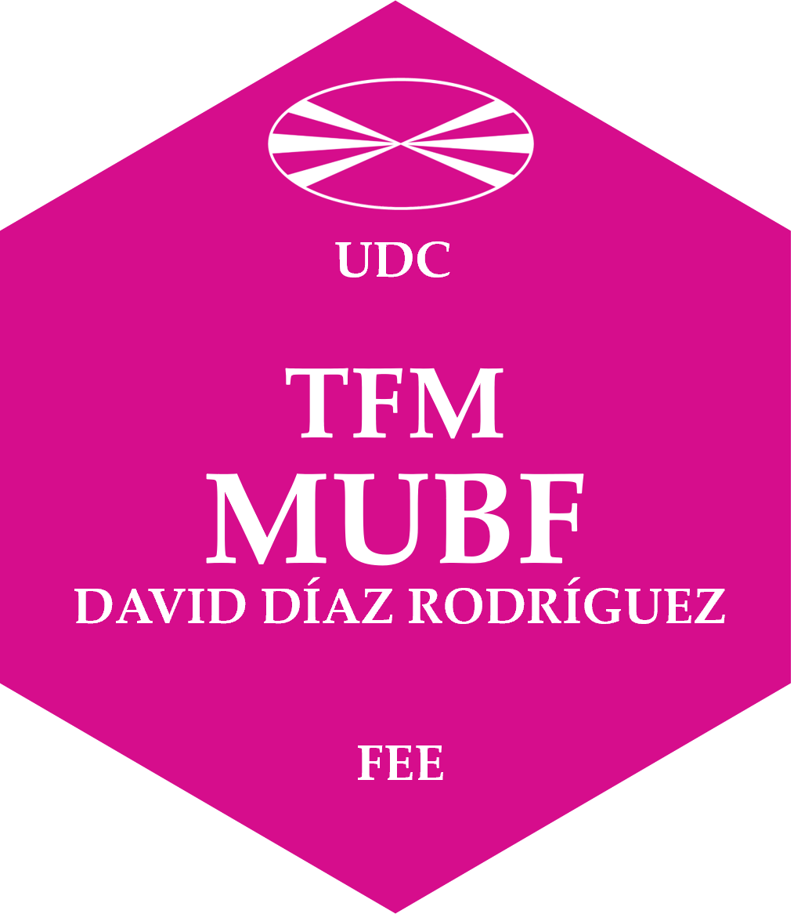

# Español

## Aplicación de redes neuronales artificiales y programación cuadrática en la gestión de carteras

 Este repositorio contiene el código fuente del sitio web del Trabajo de Fin de Máster **"Aplicación de redes neuronales artificiales y programación cuadrática en la gestión de carteras"** de David Díaz Rodríguez y tutelado por Xosé Manuel Martínez Filgueira. El sitio está construido usando [Quarto](https://quarto.org/).

Puede encontrar, además, en el presente repositorio algunos de los datos resultantes del procedimiento descrito a lo largo del trabajo así como estructuras de los modelos de RNA utilizadas para la obtención de las predicciones.

El código del procedimiento expuesto en el presente trabajo, Anexo 4, fue desarrollado usando la versión 4.3.1 de R y la versión 2023.06.1-524 del software RStudio. Los paquetes necesarios para la ejecución del código los puede encontrar al final de la descripción.

# English

## Application of artificial neural networks and quadratic programming in portfolio management

This repository contains the source code of the website of the Master's Thesis **"Application of artificial neural networks and quadratic programming in portfolio management"** by David Díaz Rodríguez and supervised by Xosé Manuel Martínez Filgueira. The site is built using [Quarto](https://quarto.org/).

You can also find in this repository some of the data resulting from the procedure described throughout the work as well as structures of the RNA models used to obtain the predictions.

The code of the procedure exposed in this work, Annex 4, was developed using version 4.3.1 of R and version 2023.06.1-524 of the RStudio software. The necessary packages for the execution of the code can be found at the end of the description.

# Galego

## Aplicación das redes neuronais artificiais e da programación cuadrática na xestión de carteiras

Este repositorio contén o código fonte da páxina web do Traballo Fin de Máster **"Aplicación das redes neuronais artificiais e da programación cuadrática na xestión de carteiras"** de David Díaz Rodríguez e dirixida por Xosé Manuel Martínez Filgueira. O sitio está construído usando [Quarto](https://quarto.org/).

Tamén podes atopar neste repositorio algúns dos datos resultantes do procedemento descrito ao longo do traballo así como estruturas dos modelos de ARN empregados para obter as predicións.

O código do procedemento exposto neste traballo, Anexo 4, desenvolveuse mediante a versión 4.3.1 de R e a versión 2023.06.1-524 do software RStudio. Os paquetes necesarios para a execución do código pódense atopar ao final da descrición.

# Paquetes

|Paquete        |Versión|
|---------------|-------|
|abind          |1.4.5  |
|DiagrammeR     |1.0.10 |
|dplyr          |1.1.2  |
|forecast       |8.21   |
|ggplot2        |3.4.2  |
|gridExtra      |2.3    |
|gt             |0.9.0  |
|jsonlite       |1.8.7  |
|kableExtra     |1.3.4  |
|keras          |2.11.1 |
|knitr          |1.43   |
|lubridate      |1.9.2  |
|Matrix         |1.6.0  |
|Metrics        |0.1.4  |
|quadprog       |1.5.8  |
|quantmod       |0.4.24 |
|readr          |2.1.4  |
|readxl         |1.4.2  |
|simplermarkdown|0.0.6  |
|stringr        |1.5.0  |
|tensorflow     |2.11.0 |
|tibble         |3.2.1  |
|tidyr          |1.3.0  |
|TTR            |0.24.3 |
|xml2           |1.3.4  |
|xts            |0.13.1 |
|zoo            |1.8.12 |

